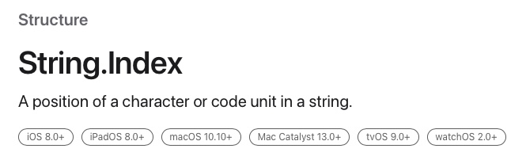

# Accessing individual Elements of String

- 다른 언어를 배우다 Swift를 배우는 사람들은 Swift의 String을 보고 경악을 합니다.
- 왜냐하면 다른 언어에서는 당연하게 접근이 가능한 integer index로 접근하는 것이 불가능하기 때문이죠.
- 이에 Swift는 특히 Coding Test 문제를 풀 때 문자열 처리가 어려워 사람들이 기피하곤 합니다.
- Swift의 String은 왜 이럴까요?

## Contents

- [Colleciton](#Collection)
- [String.Index](#String.Index)
- [Why swift use String.Index instead of Integer?](#Why-swift-use-String.Index-instead-of-Integer?)
- [Points to note](#Points-to-note)
- [The takeaway is](#The-takeaway-is)

 

## Collection

- String은 RangeReplaceableCollection이라는 protocol을 채택하고 있습니다.
- 이 RangeReplaceableCollection은 Collection protocol을 채택하고 있죠.
- 여기서 Collection을 살펴보면 **accessed by an indexed subscript**라는 단어가 있습니다.
- index로 접근이 가능하다는 뜻입니다.

- 하지만 컴파일러는 String에 index로 접근할 때마다 에러 메시지를 띄웠습니다.
- 이유는 String에 접근할 수 있는 index는 integer가 아니라 String.Index이기 때문입니다.

 

## String.Index

- String을 index로 접근하기 위해서는 String.Index를 사용해야 합니다.
- 게다가 String은 Character의 Collection이기 때문에 String.Index로 접근하면 Character Type이 나오게 됩니다.
    - [A Unicode string value that is a collection of characters.](https://developer.apple.com/documentation/swift/string/)

 

## Why swift use String.Index instead of Integer?

- 그렇다면 Swift는 왜 integer가 아닌 String.index를 사용할까요?
- "abcdef"인 string과 "😄"인 string의 memory를 비교하면 다음과 같습니다.

- "abcdef"는 각각 1칸씩 6칸을 사용하지만, "😄"는 4칸을 사용하고 있습니다.
- 이를 잘 생각해 보면, 영어 알파벳은 FF, 즉 256비트로 표현할 수 있지만, 이모지는 그렇지 않기 때문임을 알 수 있습니다.
- 조금만 더 깊이 생각해 보면 아스키코드와 유니코드의 차이임을 알 수 있습니다.
- 그렇습니다. 배열이란 연속된 공간이고, 각 공간은 동일한 크기(동일한 타입)이어야 합니다.
- 하지만 Swift의 String(Character)의 크기는 256비트에 한정되지 않고, 더 큰 공간을 가질 수 있습니다.
- Swift의 String은 배열이 아니었던 것입니다.

 

## Points to note

- String의 index 접근을 하기 위해 `index(_:,offsetBy:)` 함수를 사용하는 것에는 주의가 필요합니다.
- 배열 접근과는 다르게 해당 함수는 시간 복잡도가 O(n)이기 때문입니다.
  - [Complexity : O(n), where n is the absolute value of distance.](https://developer.apple.com/documentation/swift/string/index(_:offsetby:))

 

## The takeaway is

- Apple이 Swift의 String를 이렇게 설계한 이유는 다양성과 다양한 문화를 존중하려는 Apple의 철학이 담겼다고 생각합니다.
- 사실 이런 철학은 String에만 존재하는 것이 아닙니다.
- left가 아닌 leading, right가 아닌 trailing을 쓰는 이유도 마찬가지입니다.
- 아랍 문화권에서는 글자를 오른쪽에서 왼쪽으로 쓰기 때문에 Constraint를 leading으로 해 놓으면 자동으로 오른쪽으로 적용이 됩니다.

