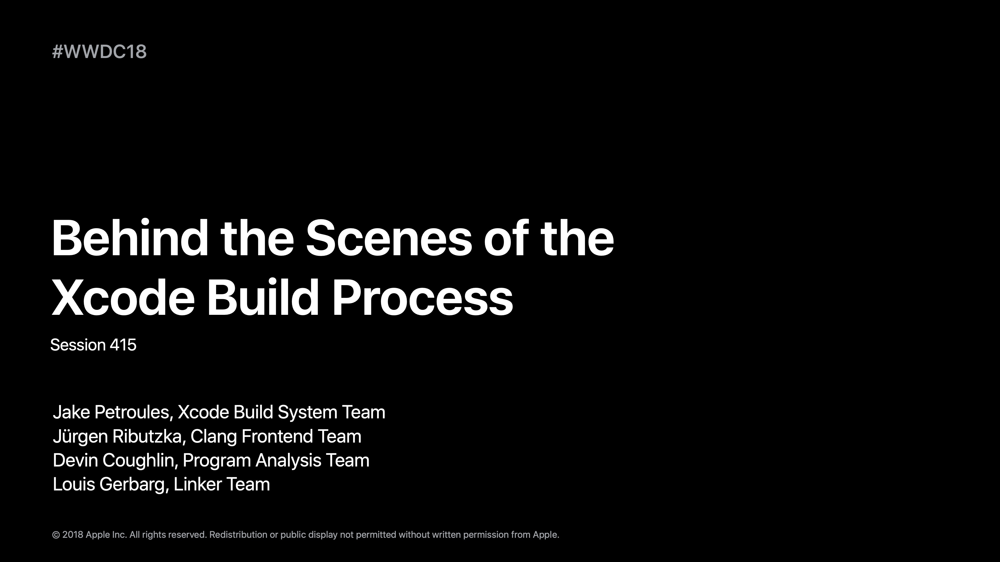
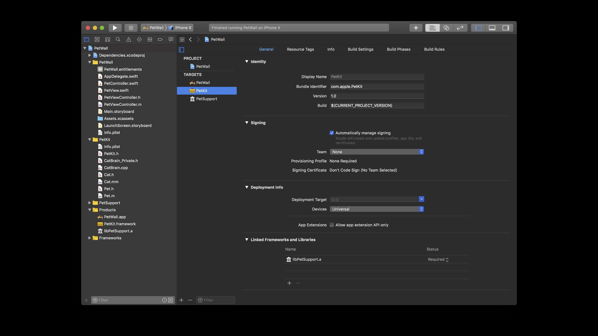
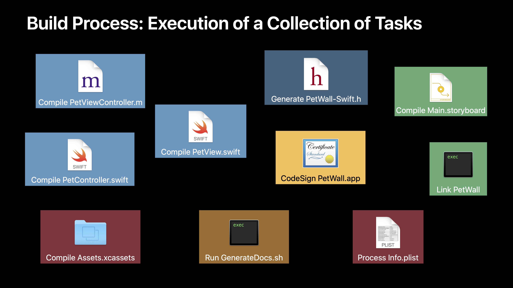
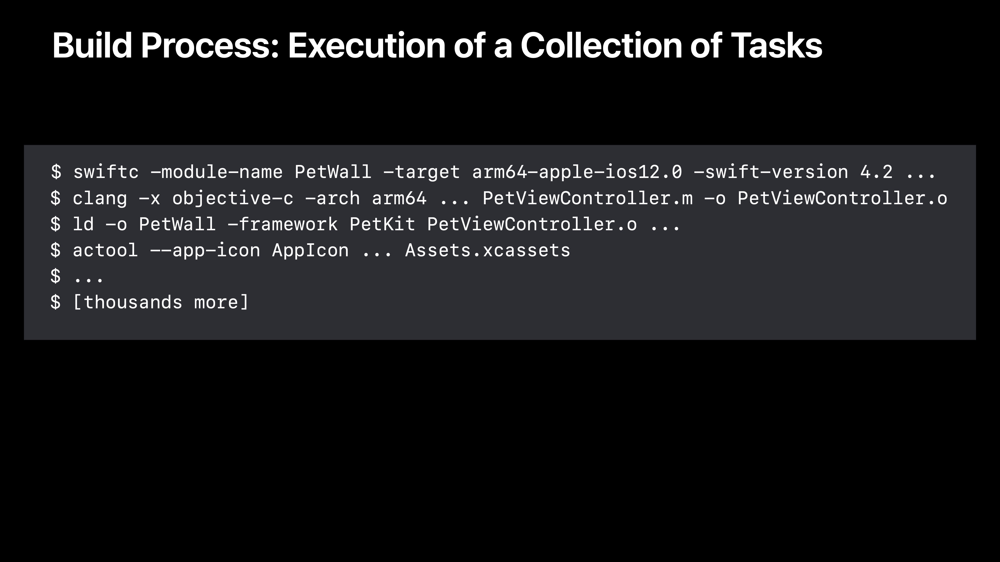
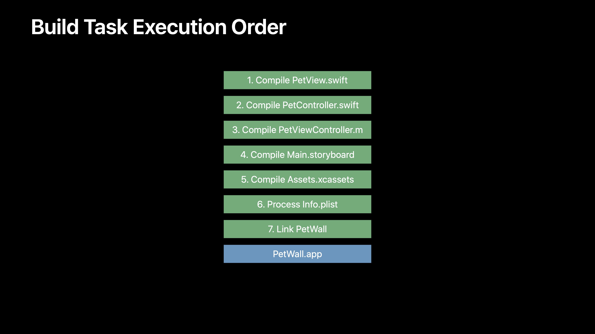
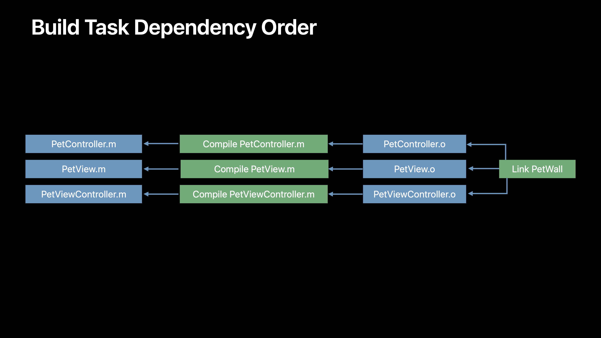
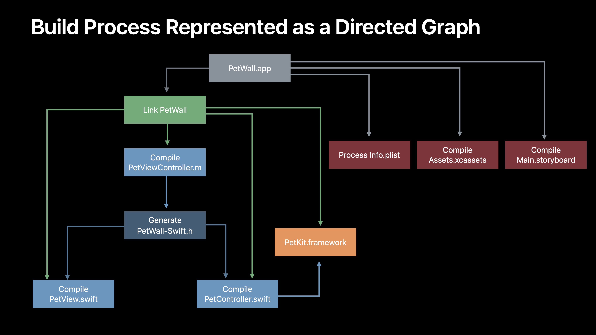
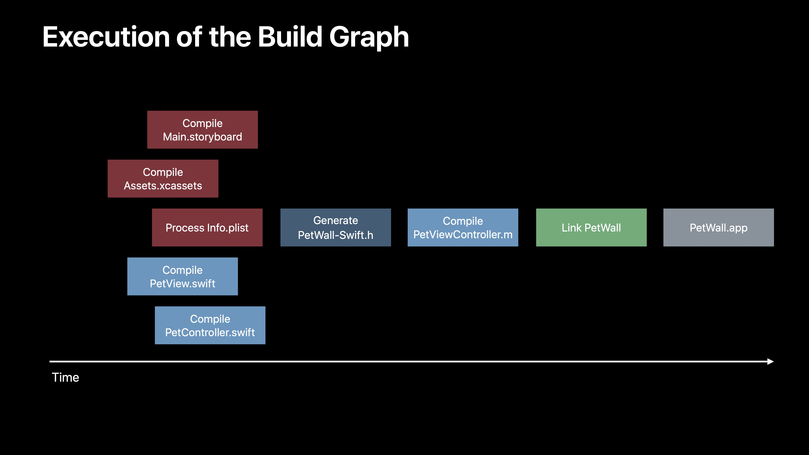
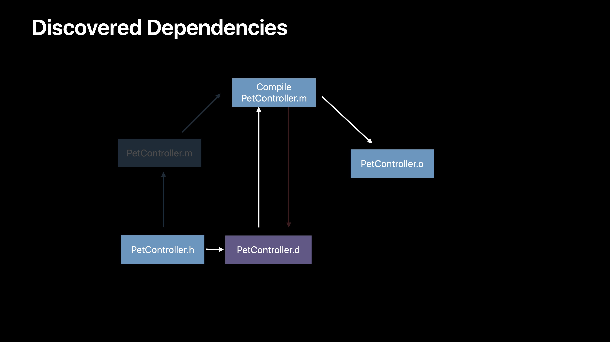

# [Behind the Scene of the Xcode Build Process](https://developer.apple.com/videos/play/wwdc2018/415/?time=400)

## Overview

- Xcode에서 Command B를 누를 때 일어나는 일에 대해 알아봅니다.
  - Build process가 어떻게 구성되어 있는지
  - Xcode가 어떻게 project file에 있는 정보를 사용하여 빌드 과정을 모델링하고, 조정하는지
  - Compiler 영역
  - Clang 과 Swift가 source code를 object files로 빌드하는 방법

- Header와 module이 어떻게 작동하는지 알려줍니다.
  - Compiler가 code에서 선언을 찾는 방법
  - Swift Compilation model이 C, C++, ObjC와 어떻게 다른지
  - symbol이 무엇인지, source code와 어떤 관련이 있는지
  - Linker가 Compiler에서 생성된 object files를 가져오고 서로 연결하여, App 또는 framework의 최종 실행 파일을 생성하는 방법  

- 예제 앱은 PetWall이라는 애완 동물 사진을 올리는 앱입니다.
  
 

## What the build process is 

- 앱을 빌드할 때의 단계
  - Source code를 compile하고 link해야 합니다.
  - Header, asset catalogues, storyboard와 같은 resources를 복사하고 처리해야 합니다.
  - code sign을 하고, shell script 또는 framework 용 API 문서 작성이나 code linting, 유효성 검사 도구를 실행합니다.

- Build 과정에서 Clang, LD, AC tool, IB tool, Code sign 등 다양한 작업은 Command line tool로 실행합니다.
- 이런 도구는 Xcode의 project 구성에 따라 특정 순서로 자동화되어 실행됩니다.

- Build 작업이 진행되는 순서는 dependency information에서 결정됩니다.

- 위 그래프 구조를 통해 dependency information이 어떻게 흐르는지 볼 수 있습니다.
  - Compile lane이 독립적이기 때문에 병렬로 실행할 수 있습니다.
  - Linker는 모든 입력을 다 받기 때문에 마지막에 옵니다.

 
  
## How the build process works

 

- Build를 누르면 먼저 Build system이 Xcode project file의 build description을 가져옵니다.
  - 구문을 분석하고 project의 모든 파일, target, dependency를 고려합니다.
  - Build setting을 directed graph라고 불리는 tree 구조로 만듭니다.
    - 입출력 파일과 이를 처리하기 위해 실행될 모든 종속성을 나타냅니다.
  - low level execution engine(llbuild)은 이 graph를 처리하고 종속성 명세를 살펴보며 실행할 작업을 파악합니다.
    - 병렬로 작업 가능한 것을 확인하고 실행 순서를 파악하여 진행합니다.

- Build system은 작업 중에 더 많은 dependency를 발견하기도 합니다.
  - Clang이 Objc file을 compile할 때 해당 source file에 포함된 header file 목록을 포함하는 다른 file을 생성할 수도 있습니다.
  - 이 경우 다음 build에 header file을 변경하는 경우 이 파일(PetController.d)을 이용하여 source file을 다시 compile 합니다.
  - 0630

