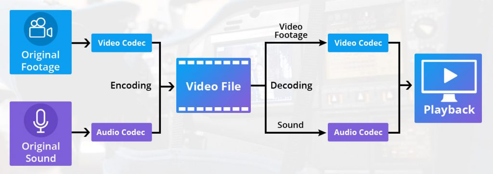
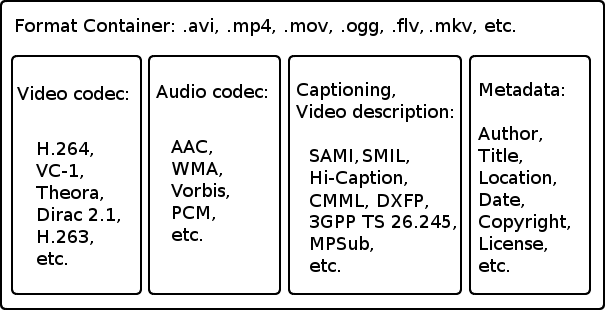
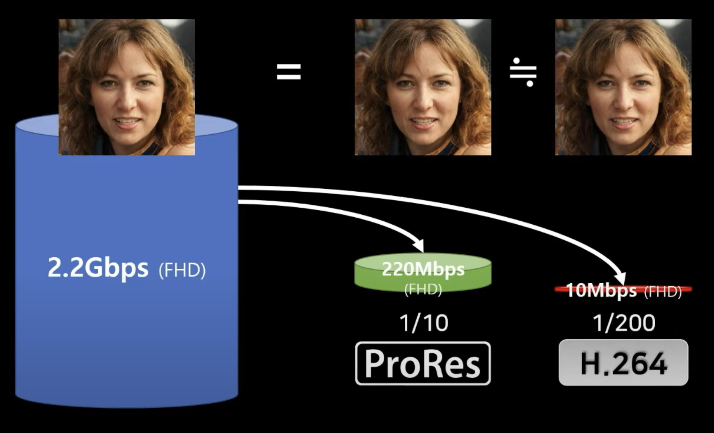
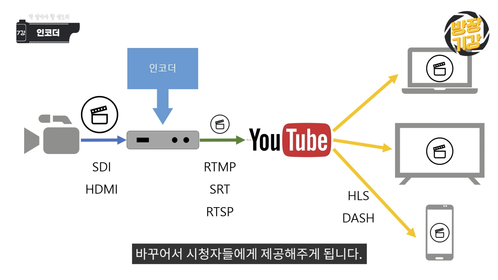

# Media Domain 지식 정리

## Table of Contentes

- [Codec](#Codec)
    - [Video Codec](#Video-Codec)
- [Encoder](#Encoder)
- [Video Streaming Protocol](#Video-Streaming-Protocol)
    - [Protocols](#Protocols)

## Codec

[이미지 출처](https://www.muvi.com/blogs/best-video-codec-for-streaming.html)

- 코덱의 뜻
    - 코덱은 Coder와 Encoder를 합친 용어입니다.
    - Compression과 Decompression을 합친 용어라고 봐도 무방합니다.
    - 영상을 용량을 압축하고, 압축한 것을 영상으로 변환해주는 역할을 하는 장치 또는 소프트웨어입니다.

- 배경
    - 1970년대에 CD가 등장하면서 아날로그 오디오가 디지털로 전환되었습니다.
    - 이 과정에서 아날로그를 디지털로 바꿔주는 장치를 코덱이라고 부르게 되었습니다.
    - 현재는 오디오, 비디오를 아울러 보편적인 미디어 변환 과정과 그 결과물을 코덱이라고 부르게 되었습니다.

[이미지 출처](https://www.w3.org/)

- 파일 확장자와 코덱
    - 동영상 확장자는 오디오, 비디오 데이터를 가지고 있는 보관함입니다.
    - WMV(Windows Media Video)
        - 윈도우에서 동영상을 재생하기 위해 Microsoft가 제작
        - 압축률도 좋지 않고, 모바일 환경에서 재생되지 않아 잘 사용하지 않음
    - AVI(Audio Video Interleave)
        - Microsoft에서 제작
        - 엄청나게 다양한 코덱을 담을 수 있는 유연함이 있음
    - MOV
        - Apple에서 제작
        - 비압축 부터 HEVC등 엄청나게 다양한 코덱을 담을 수 있음
        - 대부분 ProRes 코덱을 담음
    - MKV(Matroska Video)
        - 오디오, 비디오, 자막까지 한 번에 담음
        - 오픈소스

### Video Codec

- 비디오 코덱의 종류
    - 촬영용
        - 카메라에 저장되는 1차적 코덱입니다.
        - XDCAM, H.264m HEVC, ProRes, RAW
        
    - 편집용
        - 영상 편집에 적합한 매개 코덱입니다.
        - ProRes, DNxHD
        - ProRes가 H.264 보다 10~20배 용량이 큽니다.
    - 배포용
        - 화질은 최대한 유지하면서 파일 크기는 최소화하려는 목적으로 사용합니다.
        - 사람 눈으로 구분하기 어여룬 데이터는 삭제하고, 움직임이 적거나 멈춰있는 부분은 제거합니다.
        - 대부분의 보급형 카메라는 H.264 파일로 저장합니다.
        - H.265, H.265, HEVC

> 카메라로 촬영한 H.264(촬영용 코텍)과 인터넷에서 다운받은 H.265(배포용) 파일은 다를 수 있습니다.
> 배포용 코덱은 재편집을 위한 코덱이 아니기 때문에 편집에 어려움을 겪을 수 있습니다.

- 비트레이트와 대역폭
    - 비트레이트 : 동영상 1초에 얼마나 많은 bit를 담을 수 있는가
        - FHD Live의 경우 5Mps가 적정
        - VOD의 경우 10Mbps가 적정
    - 대역폭 : 주파수 범위(채널 용량)

## Encoder

- Encoder
    - 인코딩을 하는 모든 장비를 뜻합니다.
    - 인코딩이란 비디오를 압축하는 과정입니다. Live Streaming Encoder라고 하면 생방송 영상을 라이브로 압축해서 웹사이트로 보내줄 수 있는 장치를 의미합니다.

- 종류
    - 하드웨어 인코더
        - 부가적인 기능이 없지만, PC 없이 동작할 수 있다는 장점이 있습니다.
    - 소프트웨어 인코더
        - 부가적인 다양한 기능을 사용할 수 있습니다.
        - 대표적으로 OBS studio가 있습니다.

- 핵심 기능
    - 압축 성능과 전달 성능입니다.
    - 카메라에서 나오는 HDMI 또는 SDI 출력을 어떻게 잘 처리하는가가 인코더의 핵심입니다.
    - 이 때, 압축 방식이 화질을 의미하는 것은 아닙니다.
    - 동일한 인코더라도 화질, 안정성, 기능에 많은 차이가 있습니다.

- 라이브 전송 프로토콜
    - 인코더가 만들어 놓은 압축된 코덱을 어떤 방식으로 전달할 것인지를 나타냅니다.
    - RTMP, RTMPS, RTSP, HLS, SRT, DASH, WebRTC 등이 있습니다.

- 라이브 스트리밍의 전체 과정
    - 카메라 -> 인코더 -> 라이브 전송 프로토콜 -> 아프리카TV -> 라이브 전송 프로토콜 -> 유저
    - 이런 과정을 거치기 때문에 20~30초의 딜레이가 발생할 수 있습니다.

[이미지 출처](https://www.youtube.com/@dvnest)

## Video Streaming Protocol

- Video Streaming Protocol
    - 비디오 파일을 더 작은 조각으로 분해하여 최종 사용자가 재조립하고 볼 수 있도록 전달하는 특정 표준화된 규칙 및 방법입니다.
    - 네트워크의 상황에 따라 적절한 비디오 품질로 동적으로 조정하여 사용자에게 최적의 시청 경험을 제공합니다.

- 방송 전송의 발전 과정
    - 전통적인 TV 중계방식은 다음과 같습니다.
    - 기자 -> 중계차 -> 방송국(위성 안테나) -> 기지국(전국) -> 안테나 -> 집
    - 하지만 최근의 TV의 경우 IPTV를 통해 생방송으로 영상을 시청합니다.
    - 통신사로 영상을 보내주면 알아서 IP(Internet Protocol)을 이용해 영상을 전송합니다.
    - SNG(Satellite News Gathering)을 이용해 위성으로 지구상 어디든 영상을 전송할 수 있지만, 가격이 비싸 인터넷을 이용한 방식으로 대체되고 있습니다.

- 비디오를 전달하는 방법
    - 비디오는 네트워크를 통해 전달됩니다.
    - 그러나, 비디오 파일은 굉장히 크고, 순서가 보장이 되어야 한다는 특징이 있습니다.
    - 이런 비디오를 네트워크로 보내는 방법은 전용회선을 사용하거나, buffer를 사용하는 방법이 있습니다.
    - 전용회선의 경우 비용이 많이 든다는 단점이 있습니다.
    - buffer를 사용할 경우 비용을 절약할 수 있지만, 도착한 data를 순서대로 정렬해 보여줘야 한다는 특징이 있습니다.

### Protocols

- RTSP(Real Time Streaming Protocol)
    - IETF에서 1996년에 발표하였습니다.
    - 레거시로 평가받지만, 아직도 CCTV 에서는 사용 중입니다.
    - 화질이 깨지거나 미디어 서버를 운용하기 어렵습니다.

- RTMP(Real Time Messaging Protocol)
    - Macromedia에서 2009년에 발표한 후 Adobe에 인수되었습니다.
    - 높은 호환성과 범용성으로 현재 가장 많이 사용되고 있으며, 아프리카TV에서도 외부 장치를 이용할 때 사용중입니다.
    - 미디어 서버 구축에 비용이 많이 든다는 특징이 있습니다.
    - Adobe가 2020년에 지원을 중단하면서 보안 이슈가 발생하고 있습니다.
    - H.265(HEVC) 코덱을 지원하지 않습니다.

- SRT(Secure Reliable Transport)
    - Haivision에서 2012년에 발표하고, 2017년에 완전 공개하였습니다.
    - RTSP, RTMP의 장점은 가져오고 단점은 해결하였습니다.
    - 데이터를 보내고 무결성을 확인하는 기술로, 안정성이 뛰어납니다.
    - 전송에 암호를 걸어 보낼 수 있어 보안에 뛰어납니다.
    - SNG를 대체할 방식으로 SRT를 사용하곤 합니다.
    - 범용성, 호환성이 부족합니다.

- NDI(Network Device Interface)
    - RTMP, RTSP, SRT를 NDI로 변환해 스위칭으로 사용 후 RTMP로 전송하는 경우가 많습니다.

- HLS(HTTP Live Streaming)
    - Apple이 2009년에 발표하였습니다.
    - 비디오를 10초 단위로 잘라서 웹서버에 두고, 순차적으로 보내어 재생시킵니다.
    - 저렵한 웹 서버를 사용할 수 있다는 장점이 있습니다.
    - 애플 기기에서만 동작하기 때문에, PC는 별도의 플러그인 설치가 필요합니다.

- DASH
    - MPEG에서 2011년에 발표하였습니다.
    - 80포트를 사용해 기존의 웹서버를 그대로 이용해 미디어 서비스를 합니다.
    - HLS와 거의 비슷합니다.
    - 애플 기기에 재생되지 않습니다.

- WebRTC
    - 화상회의를 위한 protocol 입니다.
    - 딜레이가 0.5초 내외이나, 화질이 뛰어나지는 않습니다.
    - iOS, AOS, Windows에 모두 호환성이 좋아야 합니다.

- 목적에 따른 프로토콜의 분류
    - First-mile(Contribution)
        - 라이브 스트리밍의 시작점이며, 비디오와 오디오 등의 미디어 데이터를 생성하고 제공하는 과정을 의미합니다. 이 단계에서는 일반적으로 카메라, 마이크, 인코더 등을 사용하여 라이브 스트림을 생성하고, 해당 스트림을 인터넷 또는 전송 네트워크에 전송합니다. 기여 단계에서는 실제 스트리밍 컨텐츠가 생성되고 시작되는 시점입니다.
        - 1:1로만 연결되는 특징이 있습니다.
        - 화질이 좋아야 하고, 딜레이가 적어야 하며 연결의 안정성이 중요합니다.
        - RTMP, RTSP를 사용했었으나, 최근에는 SRT를 사용합니다.
    - Distribution
        - 생성된 라이브 스트림을 네트워크 상에서 전달하는 단계입니다. 이 단계에서는 생성된 스트림을 여러 서버 또는 콘텐츠 딜리버리 네트워크(Content Delivery Network, CDN) 노드로 전송합니다. CDN은 전 세계의 다양한 위치에 위치한 서버로 스트림을 복제하고 배포하여 지연 시간을 최소화하고 성능을 향상시킵니다. Distribution은 라이브 스트림을 전체적으로 액세스 가능하게 만들기 위해 필요한 단계입니다.
        - 1:n 방식으로 전송됩니다.
        - 화질과 딜레이가 중요하며, 플랫폼 업체가 받을 수 있는 방식으로 사용해야 하며, 주로 RTMP를 사용합니다.
    - Delivery
        - 사용자가 생성된 라이브 스트림을 시청할 수 있는 단계입니다. 스트리밍 서비스를 이용하는 사용자는 Delivery 단계에서 CDN에 의해 제공되는 가장 가까운 서버에서 라이브 스트림을 받아 시청합니다. 이 단계에서는 라이브 스트림이 사용자 장치로 전달되어 재생되는 과정을 포함합니다. Delivery는 최종 사용자에게 원활한 스트리밍 경험을 제공하기 위해 빠른 속도와 적절한 품질로 스트림을 전송하는 역할을 합니다.
        - HLS, DASH를 주로 사용하고, 코덱은 라이센스 비용으로 인해 고유한 자신만의 코덱을 사용하는 경우가 많습니다.
        - HD를 기준으로 7~8Mbps의 비트레이트를 가집니다.
        - 대역폭을 최소화 하는게 중요합니다.

