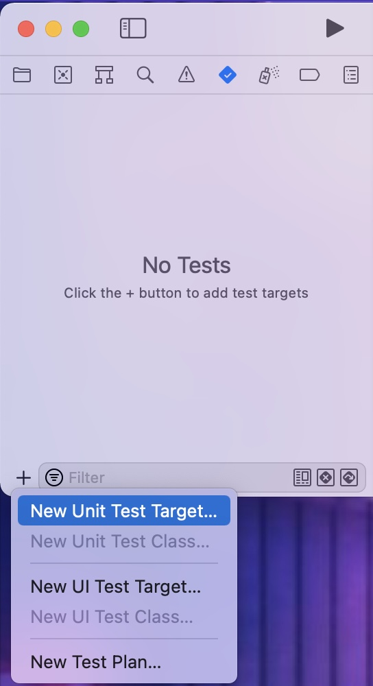
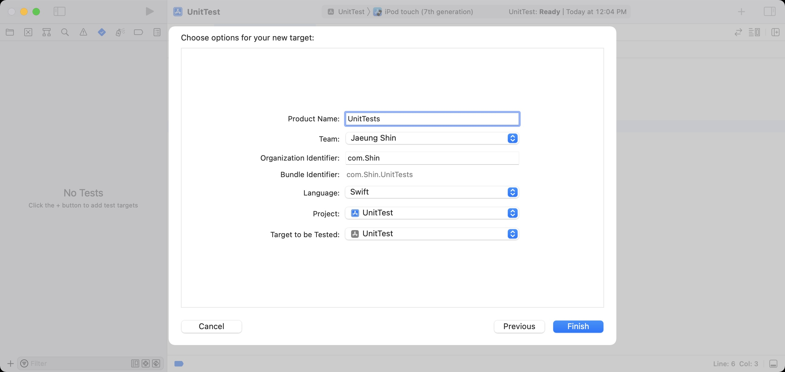
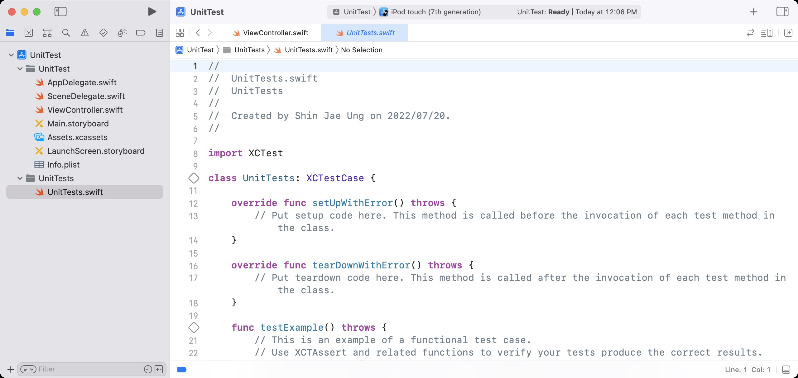
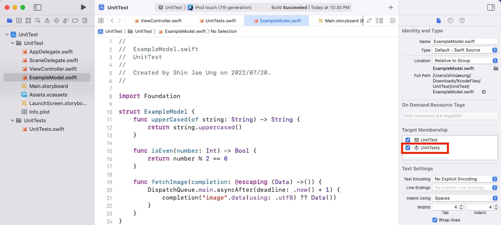
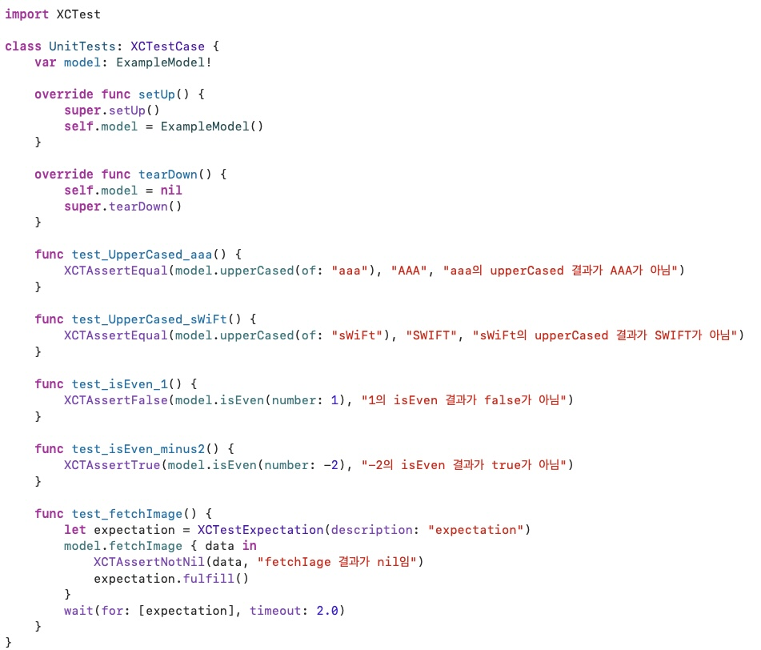
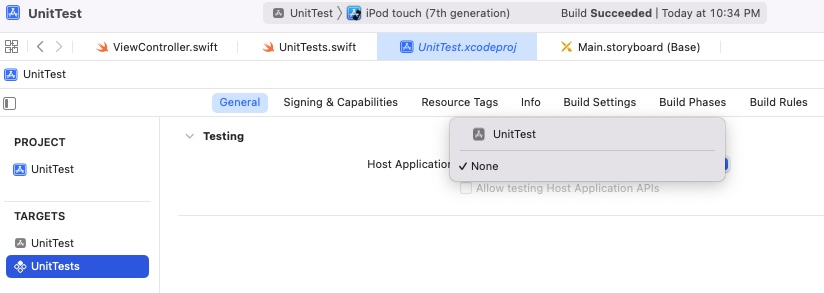
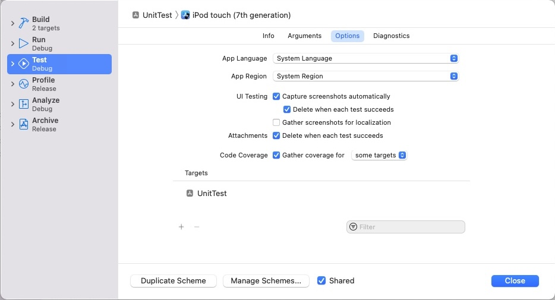
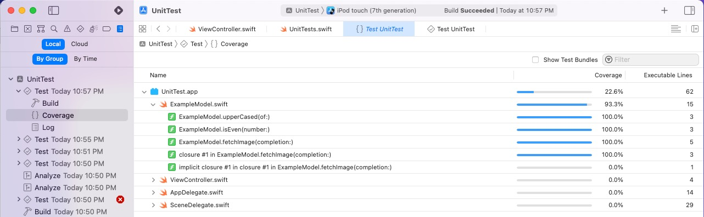

# Unit Test

- 정의
    - 모든 method에 대한 test case를 작성하는 절차입니다.
    - Source code의 특정 module이 의도된 대로 정확히 작동하는지 검증하기 위함입니다.
- 장점
    - module을 독립적인 단위로 쪼개어 검사할 수 있어 문제 발생 시 위치를 빠르게 알 수 있습니다.
    - Program의 안정성이 높아집니다.
    - Debugging 시간을 단축할 수 있습니다.
- 주의사항
    - 독립적인 실행에서 입력이 동일할 때 출력이 항상 동일한 method를 test해야 합니다.
    
<br>

## How to add unit test on Xcode





- Navigator에서 test navigator로 이동합니다.
- test navigator 하단의 + 버튼에서 `New Unit Test Target`을 선택합니다.
- 생성해주면 folder가 생기고, unit test를 할 수 있는`XCTest`를 import한 새로운 file이 만들어 집니다.

<br>

## Methods

```swift
    override func setUpWithError() throws {
        // Put setup code here. This method is called before the invocation of each test method in the class.
    }
```

- `setUp()` 또는 `setUpWithError()`
    - 위 methods는 각 test가 시작하기 전에 한 번 호출되는 method입니다.
    - 모든 methods에서 공통적으로 초기화가 필요한 내용이 있다면 여기서 실행할 수 있습니다.
    - Error를 throw할 필요가 있다면, `setUpWithError()` method를 사용하면 됩니다.
    
```swift
    override func tearDownWithError() throws {
        // Put teardown code here. This method is called after the invocation of each test method in the class.
    }
```

- `tearDown()` 또는 `tearDownWithError()`
    - 위 methods는 각 test가 종료될 때에 한 번 호출되는 method입니다.
    - test 이전의 앱 상태로 만들기 위해 복원할 내용이 있다면 여기서 실행할 수 있습니다.
        - 예) file 닫기, 새로 만든 항목 제거, call back

```swift
    func testExample() throws {
        // This is an example of a functional test case.
        // Use XCTAssert and related functions to verify your tests produce the correct results.
        // Any test you write for XCTest can be annotated as throws and async.
        // Mark your test throws to produce an unexpected failure when your test encounters an uncaught error.
        // Mark your test async to allow awaiting for asynchronous code to complete. Check the results with assertions afterwards.
    }
```

- `testFunction()`
    - 실제 test를 작성하고 실행시킬 method 입니다.
    - unit test는 각각의 testFunction 들을 독립적으로 실행시키고 실행 결과를 알려줍니다.

```swift
    func testPerformanceExample() throws {
        // This is an example of a performance test case.
        measure {
            // Put the code you want to measure the time of here.
        }
    }
```

- `performanceFunction()`
    - method의 성능을 측정하기 위해 `measure(_ block: () -> Void)` 함수를 사용합니다.
    - 기본적으로 clusure를 실행하는 데에 걸리는 시간을 측정합니다.
    
<br>

## 적용



- 먼저 Unit test를 적용할 file의 inspector 창에서 Target Membership을 등록해 주어야 합니다.

<br>



- 이후 test code를 작성합니다.
- 이 때, 각 test function 이름의 접두어를 `test`로 명시하면 각 test를 개별적으로 실행할 수 있습니다.
- 간단한 logic에도 수 많은 예외사항을 고려해야 하기 때문에 test code는 굉장히 많이 생길 수 있습니다.
- 실패한 test를 빠르게 인지하고 찾기 위해 test 함수의 이름을 snake_case나 한글로 작성하기도 합니다.
- test를 실행하기 위해서는 ctrl + command + U 를 누르거나, class 좌측의 마름모 모양을 누르면 됩니다. 

<br>

## Hacks



- simulator를 켤 필요가 없다면 Host Application을 none으로 변경하여 좀 더 빠르게 unit test를 실행할 수 있습니다.

<br>
  



- test code가 test를 하는 module을 얼마나 충분히 test 하였는지 확인하기 위해 code coverage를 확인할 수 있습니다.
- Product > Test > Options에서 Code Coverage에 check 해주고 Targets에 추가합니다.
- 이후 test를 진행하게 되면 code coverage를 확인할 수 있습니다.
