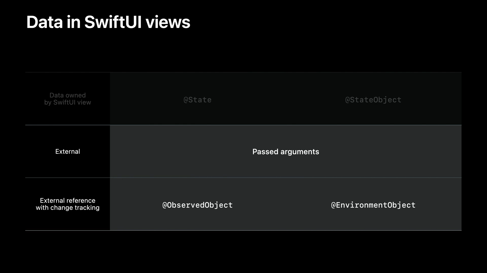

# Use SwiftUI with UIKit

- UIKit App에서 SwiftUI를 사용하는 방법을 배웁니다.
    - UIHostingController를 배웁니다.
    - 이미 만들어진 UIKit App에서 data 변화에 의해 SwiftUI view를 어떻게 Update하는지 배웁니다.
    - UICollectionView와 UITableViewCell을 SwiftUI로 만드는 기능을 배웁니다.
    - Cell 내에서 SwiftUI를 사용할 때 CollectionView와 TableView의 data flow를 배웁니다. 

 

## Table of Contents

- [UIHostingController](#UIHostingController)
- [Bridging data](#Bridging-data)
- [SwiftUI in Cells](#SwiftUI-in-Cells)
- [Data flow for cells](#Data-flow-for-cells)

 

## UIHostingController

- UIHostingController는 SwiftUI View hierarchy를 포함하는 UIViewController 입니다.
- UIHostingController는 ViewController라서 UIView를 가지고 있습니다.
    - 해당 UIView 내에 SwiftUI Content가 들어갑니다.
    
 

- SwiftUI View를 UIHostingController의 rootView로 설정하면 됩니다.
- UIHostingController는 UIViewController의 모든 API를 활용할 수 있습니다.
    - `present(hostingController, animated: true)` 처럼 사용이 가능합니다.
- UIHostingViewController의 위치나 size를 조정하고 싶으면
    - `addChild(_:)` method를 이용해서 하위 ViewController로 만들면 됩니다.

 

- iOS 16부터는 `.preferredContentSize` 또는 `intrinsicContentSize`를 이용해 자동으로 size를 update할 수 있습니다.
- sizeOptions API를 잘 쓰면 언제나 SwiftUI Content size에 알맞게 크기를 조정할 수 있습니다. 

 

## Bridging data

- UIKit 앱에서 SwiftUI로 어떻게 data를 가져오고, data가 바뀔 때마다 SwiftUI view가 어떻게 update되는지 알아봅시다.
- 먼저 UIViewController중 하나에 UIHostingController를 사용해야 합니다.

 

- SwiftUI에는 data를 관리에 유용한 다양한 data flow 요소들이 있습니다.
- SwiftUI view에서 소유하고 만들어지는 data를 저장할 때에는 `@State` 또는 `@StateObject` property wrapper를 사용합니다.
    - 하지만, SwiftUI view 외부에서 소유한 data를 사용해야하기에 두 property wrapper로는 어렵습니다.
    - [Data Essentials in SwiftUI](https://developer.apple.com/videos/play/wwdc2020/10040/)를 보면 SwiftUI view가 소유하는 data에 대해 배울 수 있으니 여기선 건너뜁니다.
- SwiftUI 외부에서 data를 가져오는 방법중 하나는 view를 초기화할 때 직접 값을 넘겨주는 방법입니다.
    - 이렇게 하면 SwiftUI가 raw data를 관리하지 않고 넘겨 받기만 하기에 data가 변할 때마다 직접 UIHostingController를 update해야 합니다.
    - 예시를 보면 hostingController가 Value type이기 때문에, 값을 변경할 수 없어 매번 새로운 view를 만들어주어야 합니다.
    
 

- 매번 수동으로 view를 만들지 않고 자동으로 update할 수 있습니다.
- `@ObservedObject` 또는 `@EnvironmentObject`는 `ObservableObject` protocol을 채택하는 model을 참조할 수 있습니다.
- model이 두 property wrapper를 사용한다면, SwiftUI는 자동으로 바뀐 data를 update 합니다.
    - 이번에는 `@ObservedObject`를 자세히 볼거라서 `@EnvironmentObject`를 알고 싶으면 [Data Essentials in SwiftUI](https://developer.apple.com/videos/play/wwdc2020/10040/)를 보세요.
- `@ObservedObject`를 사용하려면, model 객체에 `ObservableObject` protocol을 채택해야 합니다.
- 그 다음, SwiftUI view가 해당 객체를 `@ObservedObject`로 소유하면 view가 자동으로 update 됩니다.

 

- 예시를 통해 살펴보자면, 먼저 model을 만들고, model이 `ObservableObject`를 채택해야 합니다.
- 이후, 변경이 생길 때마다 view를 update해야 하는 변수에 `@Published` property wrapper를 추가해야 합니다.
- UIViewController는 model(`date: HeartData`)을 가지고 있습니다.
    - 이 model이 SwiftUI 내부에 있는 것이 아니기에 여기서는 `@ObservedObject` property wrapper를 사용할 필요 없습니다.
- 이렇게 initializer에서 한 번만 만들어 주면, 
    - `@published` property 값이 변할 때 자동으로 SwiftUI view가 update됩니다. 

 

## SwiftUI in Cells

- iOS 16의 기능인 UIHostingConfiguration을 이용하면 UIKit, CollectionView, TableView 내에서 SwiftUI를 사용할 수 있습니다.
    - view나 viewController를 추가하지 않고도 cell을 잘 구현할 수 있습니다.
    - Cell configuration을 알아보려면 [Modern cell configuration](https://developer.apple.com/videos/play/wwdc2020/10027/)을 보세요.

- UIHostingConfiguration을 이용하면 내부에 바로 view를 만들 수 있습니다.
- UICollectionView 또는 UITableView Cell의 contentConfiguration을 UIHostingConfiguration으로 설정하면 됩니다.
    - 내부에서 view modifier를 사용할 수 있고, 독립적인 view를 만들어 사용해도 됩니다.

- iOS 16의 Swift Chart를 사용하면 작은 꺾은선 차트도 넣을 수 있습니다.
    - [Hello Swift Charts](https://developer.apple.com/videos/play/wwdc2022/10136/)를 꼭 보기 바랍니다.

- 기본적으로 SwiftUI content는 UIKit cell의 layout margin을 기준으로 삽입됩니다.
    - margin 추가하거나, cell의 가장자리까지 content를 확장할 수 있습니다.
    - 이 때 margins modifier를 사용하면 됩니다.  

- cell의 background를 변경하고 싶으면 background modifier를 사용하면 됩니다.

- UIHostingConfiguration의 background와 content의 background는 다릅니다.
    - background는 cell 뒤에 깔리며, 끝과 끝까지 펼쳐져 있습니다만, content는 cell 가장자리의 inset을 차지합니다.
    - cell의 크기는 content에만 영향을 받습니다. 
    

- list의 경우 cell 아래의 separator는 text에 맞게 자동정렬됩니다.
    - 예시처럼 divider가 text 시작 지점에 정렬되어 있죠.
    - 다르게 구성하고 싶으면 `alignmentGuide` modifier를 사용하세요.

    

- CollectionView 또는 TableView에서 swipe action도 쉽게 넣을 수 있습니다.
    - `swipeAction` modifier에 button을 추가해 custom 동작을 실행할 수 있습니다.
    - 이 때 index path를 사용하면 cell이 보이는 동안 변경되기에 잘못된 item에 동작이 적용될 수 있습니다.
- UIHostingConfiguration을 사용하더라도 tap, highliting, selection같은 상호작용은 여전히 잘 동작합니다.
    

- UIKit cell의 상태와 상관없이 SwiftUI view를 따로 바꾸고 싶다면
    - `configurationUpdateHandler`를 이용해 SwiftUI에서 제공하는 상태를 사용할 수 있습니다.
    - cell의 상태가 변할 때마다 다시 실행되어 새로운 UIHostingConfiguration을 만들어 cell에 적용합니다.
    
 

## Data flow for cells

- model layer에서 data flow를 관리하는 법을 배워봅시다.
- App이 MedicalConsition model collection를 표시하려면 diffable data source가 필요합니다.
    - 그 후 각 model의 identifier마다 diffable data source의 snapshot을 채워야 합니다.
        - diffable data source snapshot이 객체 자체가 아니라, 객체의 identifier를 포함하고 있는 게 중요합니다.
        - 이렇게 해야 diffable data source가 identifier를 정확하게 추적하여 변경이 발생할 때 새 snapshot을 잘 계산할 수 있습니다. 
- identifier를 포함한 snapshot을 diffable data source에 적용하면 자동으로 CollectionView가 update 됩니다.

 

- 항목이 삽입 삭제되거나 순서가 바뀌는 등 data collection 자체가 바뀌는 경우
    - 새로운 snapshot을 적용해 처리합니다.
    - collection data 자체의 변화는 cell 내부에는 영향을 미치지 않으니 UIKit과 SwiftUI 둘다 동일하게 처리합니다.
- 개별 model 객체 속성이 바뀌는 경우 cell의 view를 update 해야합니다.
    - diffable data source는 identifier만 가지고 있기에 속성이 언제 변경되는지 모릅니다.
    - UIKit에서는 snapshot 항목을 수동으로 apply 했습니다.
    - SwiftUI에서는 `@ObservedObject`를 저장하여 자동으로 view를 고칠 수 있습니다.
        - 때문에 diffable datasource나 UICollectionView를 거치지 않고 update됩니다.

- SwiftUI cell이 UIKit을 거치지 않고 어떻게 cell의 크기를 resize할 수 있는데요
    - UIHostingConfiguration이 이 작업을 담당합니다.
    - iOS 16의 UICollectionView나 UITableView의 self-sizing cell이 필요한 경우 cell 크기를 자동으로 재조정합니다.
    - [What's new in UIKit](https://developer.apple.com/videos/play/wwdc2022/10068/)에서 자세히 배울 수 있습니다.

 
    
- SwiftUI View에서 밖으로 data를 전송하는 방법도 알아야 합니다.
- ObservableObject의 published property에 양방향 binding을 만들 수 있습니다.
    - model에서 SwiftUI View로 data 보낼 수 있으면서도
    - SwiftUI에서 model의 속성을 변경 할 수 있습니다.

 

- UIHostingController를 사용할 때에는 view와 view controller를 함께 추가해야 합니다.
- UIHostingConfiguration을 이용하면 UIViewController 없이 SwiftUI view를 host할 수 있습니다.

## Reference

- [Use SwiftUI with UIKit](https://developer.apple.com/videos/play/wwdc2022/10072/)
