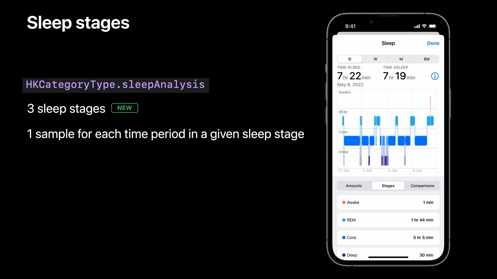
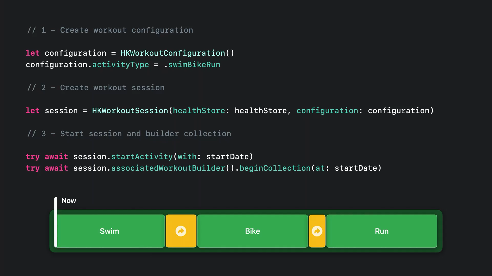
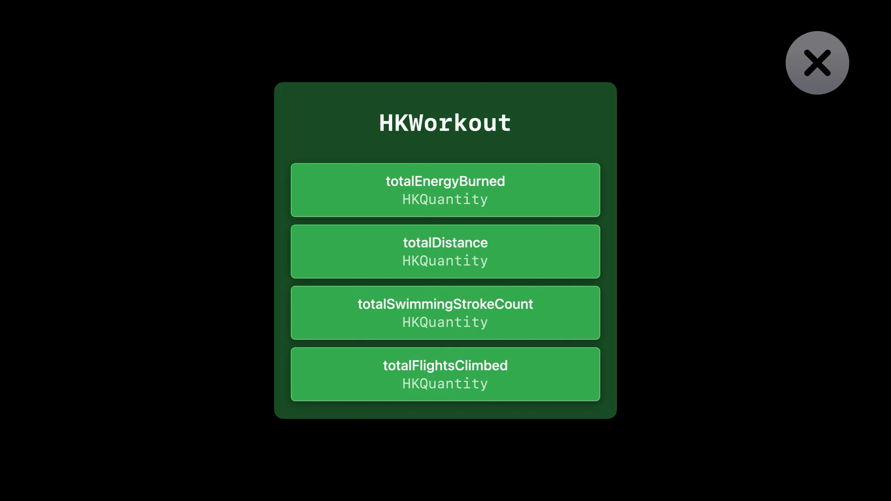
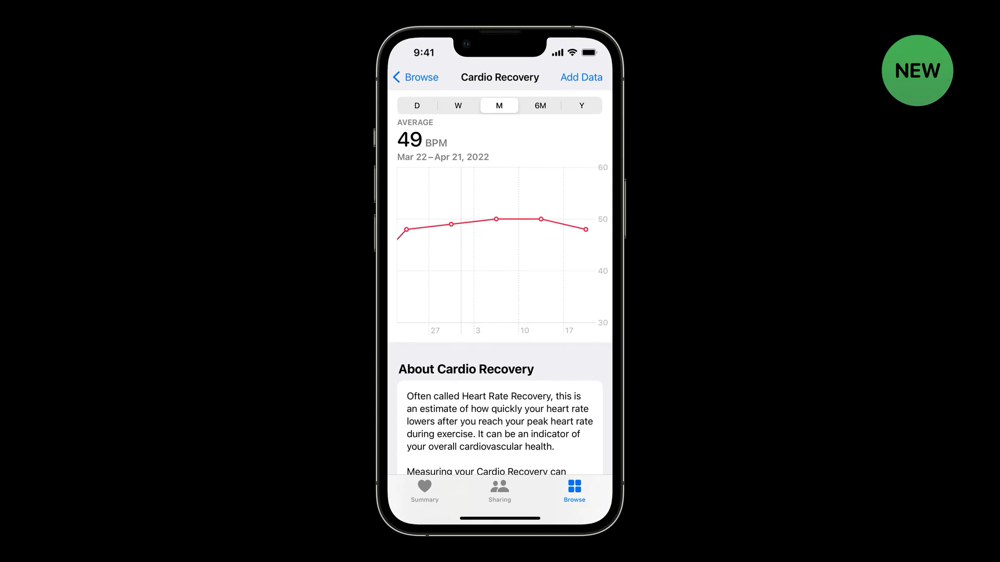
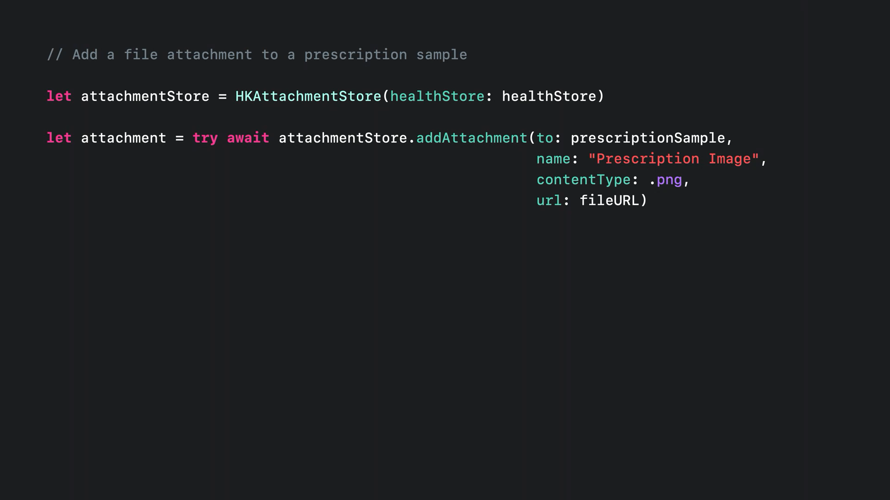

# What's new in HealthKit

- [What's new in HealthKit](https://developer.apple.com/videos/play/wwdc2022/10005/?time=44)

 

## Contents

- [Sleep analysis(수면 추적 기능)](#Sleep-analysis)
- [Swift async(비동기 데이터 조회)](#Swift-async)
- [Workouts(운동)](#Workouts)
- [Vision prescriptions(시력 처방전 저장)](#Vision-prescriptions)

 

## Sleep analysis

- Sleep stages
    - Apple Watch는 자동으로 수면 중 겪게 되는 다양한 수면 단계를 기록하고, 이 데이터는 건강 앱 또는, HealthKit에 저장됩니다.
    - 수면 데이터는 sleepAnalysis 식별자로 HealthKit에 표현됩니다.
    - HealthKit에서는 3단계의 Sleep stage를 제공합니다.
        - Rem, Core, Deep

- HKCategoryValueSleepAnalysis
    - 수면 sample value는 Sleep stage 3가지를 포함시켜 총 6단계로 구분됩니다.
    - asleepCore : AASM 평점 모델에서 1, 2단계에 해당
    - asleepDeep : AASM 평점 모델에서 3단계에 해당
    - asleepREM : AASM에서 REM 단계에 해당

- Predicate 방법
    - 1. stagePredicate를 만든다.
    - 2. queryPredicate를 만들기 위해 type에 `.sleepAnalysis`, predicate에 위에서 만든 stagePredicate를 넣는다.
    - 3. 만들어진 queryPredicate로 query를 만든다.
    - 4. query를 돌리면 sleepSampleArray를 받을 수 있다.

 

## Swift async

- Query는 HealthKit의 필수 요소중 하나입니다.
- HealthKit의 다양한 data를 읽게 해줍니다.
- 이제 completion handler 없이 비동기 `result(for:)` 함수를 호출하기만 하면 쉽게 초기값을 얻을 수 있습니다.
- 초기값과 업데이트도 받아보고 싶으면 `results(for:)` 함수를 호출하면 `AsyncSequence`를 받을 수 있습니다.

 

## Workouts

- iOS 16 부터는 여러 운동과 활동을 동시에 하는 경우에도 잘 기록됩니다.

- 각 활동은 HKWorkoutActivity로 표현됩니다.
    - workoutConfiguration에는 활동 타입이 포함됩니다.
    - workoutEvents에는 운동 중 일어난 이벤트 목록이 있습니다.
    - statistics에는 특정 활동에 대한 통계치를 확인할 수 있습니다.
- 각 활동은 겹칠 수 없고, 활동이 끝나자마자 다음 활동이 시작하지 않아도 됩니다.
- 운동 변환 시기를 분석하려면 `.transition` 타입으로 HKWorkoutActivity를 만들 수 있습니다.

- HKWorkoutBuilder 사용하여 활동 추가하기
    - builder에 `addWorkoutActivity` 함수를 이용해 십게 활동을 추가할 수 있습니다.

 

- Apple Watch에서 운동 추적하기
    - 1. HKWorkoutConfiguration 만들기
    - 2. HKWorkoutSession 만들기
    - 3. session의 startActivity(with:) 함수 호출하기
    - 4. session의 associatedWorkoutBuilder()에서 beginCollection(at:) 함수 호출하기
    - 5. session의 beginNewActivity(Configuration:, date:, metadata:) 함수 호출하기
    - 6. 각 운동이 시작될 때 workoutBuilder.dataSource에서 필요한 data만 수집
    - 7. 활동이 종료될 때 session.endCurrentActivity(on:) 함수를 호출

- 운동 전환 시기 추적하기
    - 1. session.beginNewActivity(configuration:, date:, metadata:) 함수를 호출
    - 2. workoutBuilder.dataSource에서 disableCollection(for:) 함수를 호출해 data를 더 받지 않음
    - 3. 다음 운동이 시작되기 전 session.endCurrentActivity(on:) 함수를 호출

- 끝내기
    - session.end() 함수 호출
    - workoutBuilder.finishWorkout() 함수 호출

- 이번에 변한 속성
    - 모든 종류의 운동에 대한 수치를 읽을 때에는 statistics(for:) 함수를 사용하면 됩니다.
    - 이 방식은 HKWorkoutActivity에서도 동일하게 운동 중 어떤 일이 일어났는지 확인할 수 있습니다.
    - 이런 통계가 운동으로 수집된 모든 sample에서 자동으로 계산되게 하려면 HKLiveWorkoutBuilder를 사용해야만 합니다.

- 운동 통계 predicate 방법
    - 1. HKQuery.predicateForWorkoutActivities로 predicate 생성
    - 2. HKQuery.predicateForWorkouts에서 workoutPredicate를 생성
    - 3. HKSampleQueryDescriptor에서 predicate를 이용해 query 생성
    - 4. query.result(for:) 함수를 이용해 운동 목록을 얻어냄

- 인터벌에서 통계치 얻기
    - 먼저 인터벌 활동에서 활동 타입이 동일하게 해야 합니다.

- Heart Rate Recovery
    - 스트레스를 받은 후에 심장이 회복되는 방식으로 잠재적 위험을 확인할 수 있습니다.
    - iOS16 부터 Cardio Recovery data type을 도입했습니다.
    - Apple Watch에서 HKLiveWorkoutBuilder를 사용하면 심장 박동 수 회복 샘플이 자동으로 운동 후 HealthKit에 저장됩니다.

 

## Vision prescriptions

- 미국 성인의 75%가 렌즈나 안경으로 시력을 교정하고 있습니다.
- 안경이나 렌즈 처방전은 항상 챙겨야 하지만 분실이 쉽습니다.
- iOS16 부터 HealthKit 내에 처방전을 저장할 수 있습니다.

- 실제 처방전을 image나 pdf로 저장할 수 있습니다.
- HKVisionPrescription
    - HKGlassesPrescription
        - Left eye: HKGlassesLensSpecification
        - Right eye: HKGlassesLensSpecification
    - HKContactsPrescription
        - Left eye: HKContactsLensSpecification
        - Right eye: HKContactsLensSpecification

- 처방전 저장하기
    - 1. 좌, 우측 LensSpecification 만들기
    - 2. prescription 만들기
    - 3. healthStore에 save

- 처방전 사진 저장하기
    - HKAttachmentStore를 사용해 파일을 저장하고 읽을 수 있습니다.

- 처방전 사진 보호
    - 앱에서 처방전 사진에 접근하려면 새로운 API를 이용해 접근 권한을 요청해야 합니다.
