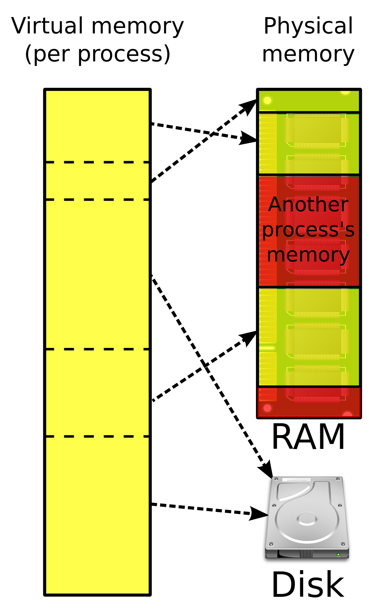

# iOS Memory

## Contents

- [Memory Hierarchy](#Memory-Hierarchy)
- [Virtual Memory, Physical Memory](#Virtual-Memory,-Physical-Memory)
- [iOS Virtual Memory Structure](#iOS-Virtual-Memory-Structure)
- [Stack vs Heap](#Stack-vs-Heap)
- [Swift Types](#Swift-Types)
- [Memory analysis by type](#Memory-analysis-by-type)
- [Q&A](#Q&A)

<br>

## Memory Hierarchy


- Physical Memory
    - Computer는 기억장치가 필요하고, 저렴한 가격에 빠른 성능을 내기 위해 기억장치의 계층이 존재합니다.
    - Memory 계층에는 크게 Register, Cache, RAM, ROM(SSD, HDD)이 있습니다.
- Register(32bit, 64bit)
    - CPU 안에 존재하는 저장 공간이고, 1bit의 정보를 저장할 수 있는 flip-flop의 집합입니다.
- Cache
    - CPU Chip 내에 별도의 회로에서 독립적으로 존재하는 저장 공간입니다.
    - L1, L2, L3 cache로 나누어져 있습니다.
- RAM
    - Program이 실행되는 동안 필요한 정보를 저장하는 공간입니다.
    - Data가 순차적이 아닌 임의의 순서로 Access 할 수 있습니다.
- ROM(HDD, SSD)
    - 영구 저장 장치입니다.

<br>

## Virtual Memory, Physical Memory

 

- Virtual Memory
    - Program이 동작하려면 memory가 필요하고, 이는 운영체제에 의해 RAM에 할당됩니다.
    - 이때, 실제 물리적인 RAM의 주소를 알려주는 것이 아니라, 가상 memory 주소를 알려줍니다.
    - 이를 **가상 메모리 방식**이라고 합니다.
- Physical Memory
    - 가상 memory는 연속된 공간이라고 생각하지만, 실제로는 여러 군데에 나누어 존재합니다.
    - Paging 방식은 Virtual memory를 일정한 크기의 page로 나누고, Physial memory를 동일한 크기의 frame으로 나누어 mapping 합니다. 
    - 실제 memory에 접근할 때에는 Page table을 사용하여 논리 memory를 실제 memory로 변환하여 접근합니다.

<br>

## iOS Virtual Memory Structure


- iOS의 Virtual Memory 구조는 다음과 같습니다.
    - Code 영역
        - Source Code가 기계어 형태로 변형되어 있어 Read-Only
        - Compile time에 결정됨
        - non thread-safe
    - Data 영역
        - static variable 혹은 전역 변수가 저장됨
        - Compile time에 결정됨
        - non thread-safe
    - Heap 영역
        - 동적 할당(malloc) 하는 영역
        - reference type을 저장
        - Run time에 결정됨
        - non thread-safe
        - ARC에 의해 관리됨
    - Stack 영역
        - 함수 호출 시 지역변수, 매개변수, 반환 값 등이 저장됨
        - value type을 저장
        - Compile time에 결정됨
        - thread-safe(thread 별로 독립적인 Stack 영역을 가지고 있음)
        - Thread 혹은 함수가 종료되면 저장된 memory도 자동 해제

<br>

## Stack vs Heap 

- Stack이 Heap보다 빠른 이유
    - Stack의 Size는 Compile time에 결정됩니다. 따라서 할당할 때에 정해진 크기를 따라 빠르게 움직일 수 있습니다. 
    - 또한 Stack의 객체들은 CPU의 L1 cache에 담길 확률이 높기 때문에 접근 속도가 더 빠릅니다.
    - Heap의 Size는 Run time에 결정되기 때문에 운영체제가 memory를 훑으면서 할당 가능한 연속된 memory를 찾고 반환해야 합니다.
    - Swift에서는 ARC를 사용하기 때문에 Heap의 객체들은 reference count를 위한 공간이 추가로 필요하고, 이를 계산해야 하는 시간도 따로 필요합니다.
    - Heap에 할당된 객체는 Thread safe 하지 않기 때문에 이를 처리하기 위한 logic이 추가로 필요하므로 느립니다.

<br>

## Swift Types

- Swift의 type은 Named type과 Compound type, 2가지로 나누어 집니다.
    - Named type에는 class, struct, enum, protocol이 있습니다.
        - array, dictionary, optional type은 Named type에 속합니다.
        - 숫자, character, string은 Named type에 속합니다.
        - Named type은 extension으로 확장이 가능합니다. 
    - Compound type은 function과 tuple이 있습니다.

```swift
@frozen public struct Int
@frozen public struct Double
@frozen public struct String
@frozen public struct Array<Element>
@frozen public struct Dictionary<Key, Value> where Key : Hashable
@frozen public enum Optional<Wrapped>
```

<br>

## Memory analysis by type

- [참고 사이트](https://medium.com/@jungkim/스위프트-타입별-메모리-분석-실험-4d89e1436fee)

 

- vmmap을 사용하면 memory 영역의 크기를 직접 확인할 수 있습니다.
- MacOS에서 Stack의 크기는 8176KB이고, 주소는 16f604000-16fe00000 입니다.
- vmmap에서 알게 된 Stack의 주소 범위를 이용해 각 type이 어디에 할당되는지 확인하였습니다. 
    - Struct는 주로 stack에 할당됩니다.
    - Class는 heap에 할당됩니다.
    - Closure는 reference type으로 heap에 할당됩니다.
    
 

- Struct
    - property를 순차적으로 Stack에 저장합니다.
    - memory size는 property별 memory size의 합과 동일하나 실제로는 동일한 값을 두 번 저장하고 있어 memory size가 2배인 것으로 보입니다.

 

- String
    - 15 Bytes 이내의 경우 Stack에 저장됩니다.
    - 16 Bytes 이상인 경우 Heap에 저장됩니다. 


- Enum
    - enum이 차지하는 memory는 case의 갯수 -1 입니다.
    - case가 1개인 경우 memory를 차지하지 않습니다.
    - case가 2개 이상인 경우 stack에 저장됩니다.

<br>

## Q&A

- stack에 존재하는 struct는 언제 해제되나요?
    - 함수 내부에 선언된 struct는 함수가 끝나면 해제됩니다.
    - main 함수에서 실행된 struct는 main 함수가 끝나기 전에는 해제되지 않습니다.
    - 우리가 heap 영역을 사용하는 이유가 여기 있습니다. 언제든지 사용자가 할당하고 해제할 수 있기 때문입니다.

- class 내부에서 struct를 property로 가지고 있으면 어디에 할당되나요?
    - 해당 struct는 heap 영역과 stack 영역에 모두 할당됩니다.

- struct 내부에서 class를 property로 가지고 있으면 어디에 할당되나요?
    - 해당 class는 heap 영역에 할당됩니다.
